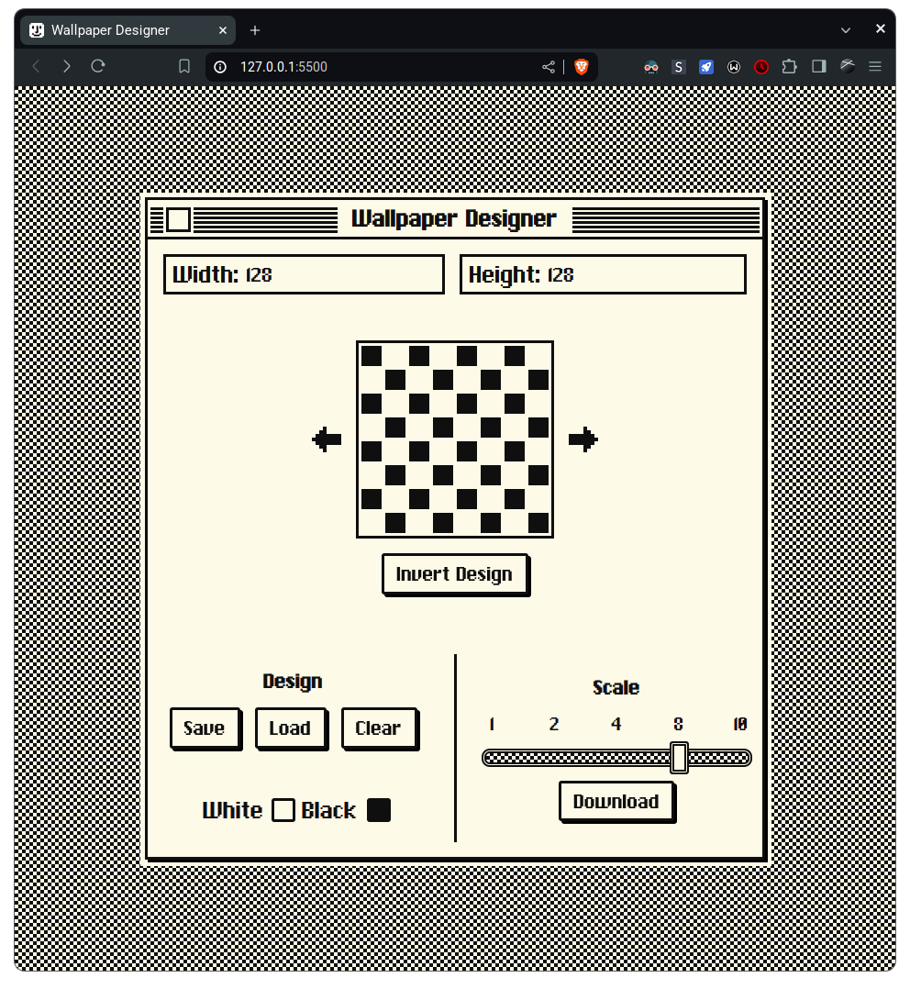

# MacOS Background Generator

This is a simple tiled background generator built in simple HTML, JS and CSS. Inspired by the awesome design and simplicity of the original System 1 operating system for Macintosh. Featuring an 8x8 grid, you can draw your own patterns and save them as images. Or you can just explore all the original patterns from the first verion of the Macintosh System Software.

## How to use

Simply draw your desired pattern in the grid and watch it update live on the background of the page.

To save the image, set your width and height and at the top, select the desired scale. Then click Download.

You can also save your awesome patterns by clicking the save button. Then load them back in by clicking the load button.

For a more personalized experience, you can change the colors of the pattern by clicking the color picker and selecting the desired color.

## Features

- [x] Save and load patterns
- [x] Download image
- [x] Change scale
- [x] Customize colors

